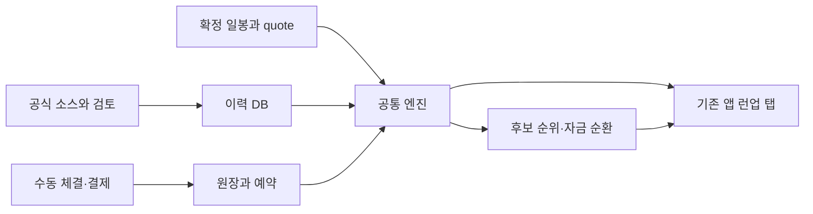

# 최종 웹스캐너 완료 기준
기준: 미국 BIO·PHARMA·SPACE,무료 필수 데이터,기존 Streamlit 런업 탭,확정 일봉+장중 위험.
다음 항목별로 PASS/FAIL/NEEDS_INPUT/LIVE_UNVERIFIED와 증거를 구분한다.

## 사용자가 실제로 쓸 화면
1. 기존 단타 탭과 새 런업 탭이 같은 앱에서 렌더된다. 기존 1초 refresh/admin/session/구독을 보존한다.
2. PC 표와375px 모바일 카드가 같은 read model과 값·source·시각·profile hash를 보여준다.
3. 캘린더에 event type/date precision/source/변경/검토 상태가 보이고 단순 PCD와 readout을 구분한다.
4. WATCH/SETUP/TRIGGER/ENTRY_ELIGIBLE/ALLOCATABLE/실제 OPEN을 구분한다.
5. feature/quote/event/source가 부족하면 이유가 표시되고 안전/0건/승률로 오표시하지 않는다.
6. 보유에서는 event deadline/CRITICAL/구조/hard stop/Exhaustion target과 추가 권고 수량이 보인다.
7. actual fill·미체결 예약·청산 권고가 분리된다. 유효시간 지난 신호를 재사용하지 않는다.
8. cash/미결제/결제확인/수량/원가/실현손익/reserve/earmark/월정산/인출이 같은 원장에 연결된다.
9. 후보 없음은 CASH_WAIT,비용None/NAV불명/quote지연불명은allocation보류다.
10. settings는117개 중앙schema를사용하고불변profile/history/active hash가일치한다.
11. 수집상태는capability/coverage/lastsuccess/실패/lastgood/LIVE_UNVERIFIED를보여준다.
12. UI 재실행/tab 열기가HTTP/scan/worker enable을자동수행하지 않는다.
13. command는서버측writer권한과idempotency를검사한다. 읽기방문자가원장/설정을쓸수없다.
14. worker enable/disable/restart/lease/fencing/중단cursor와새event risk가작동한다.
15. backend owner/client/calendar/KIS limiter를중복생성하지않고quote 정책을단타와섞지않는다.
16. consistent backup/restore/replay/로그/의존성/영구저장 운영방법이문서화된다.

## 동작을 직접 이어서 검사할 흐름
출처있는event→mapping review→일봉/basis/finality→SETUP→TRIGGER→rank/proposal→manual allocation
→실제수동fill→보유risk/부분권고→수동sell→미결제→결제확인→새후보rollover→월이익proposal→인출확인.
합성fixture와손계산으로각cash/qty/cost/P/H/reserve/earmark를대조한다.
실제trade/performance 결과라고표시하지않는다. 자동주문·송금·실제알림전송0을확인한다.
Critical/조기공개/일정충돌/pricegap/unknown trade time/중복제출/DB rollback/재시작경로도검사한다.

## 실제 운영 준비
각source가자동인지manual인지검증된범위를확인한다. 모든종목을완전히수집했다고가정하지않는다.
전혀실제데이터연결을확인하지않았다면LIVE_SCAN_READY라고선언하지않는다.
가격source/basis/finality/체결시간지연과필요broker/capital설정상태를명시한다.
trade time이없는KIS수신시각만으로실시간exchange quote를검증했다고하지않는다.
worker가꺼져있거나감시지원을확인하지못했으면감시/보호중이라고표시하지않는다.
UI와code기능이완성돼도누락된운영입력은NEEDS_INPUT으로남긴다.

## 최종 제출
READY_FOR_CODEX_REVIEW로보고한다.최종독립검토·배포·수익성검증완료를대신선언하지않는다.
- actual workspace/commit 또는변경manifest/latest file hash/기존dirty와ownchanges 구분.
- 실행명령·실제dependency/version·configschema/profilehash·단계검사명령/결과.
- PC/mobile·기존단타회귀·권한·rerun·원장replay·causal prefix·중복command·source실패 증거.
- source 실제요청시간/coverage/capability/available_at/basis/미확인목록.
- 최신PROGRESS의runup namespace·checkpoint SELF_CHECKED vs 독립review 기록.
- 명시운영미입력과수동/unsupported범위;원격반영 여부와배포pending.
export는allowlist만,secret/.env/auth cache/account/실제portfolio원문은기본제외한다.
원격배포는기존AGENTS의승인·일일push·livebaseline보호를따른다.허가없으면local-ready로완료보고한다.

## 데이터 흐름

